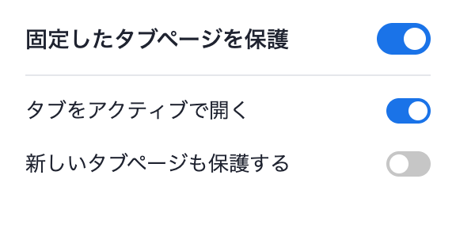

# Pinned Tab Lock

固定タブが別のサイトで上書きされるのを防ぐ Chrome 拡張 (MV3)。

固定タブを開いたままブックマークをクリックしたりアドレスバーに URL を入れたりすると、
Chrome はその固定タブの中身を差し替えてしまう。この拡張はそれを検知して、
**別サイトへの遷移だけを新しいタブに逃がし、固定タブは元のページに戻す**。

守る対象のサイトを設定に書く必要はない。**固定した時点でそのタブが開いていたサイト**が
そのまま持ち場になる。

## 動作

- 固定タブ内で別サイトへ遷移しようとしたら、新しいタブで開き直す
- 同じサイト内のページ移動・リロードはこれまで通り固定タブの中で行える
- 固定を解除すれば制限も消える
- 逃がした先のタブに切り替えるか、バックグラウンドで開くかを選べる
- ツールバーアイコンから保護全体のオン/オフと上記の設定を切り替えられる
- アイコンの色で保護のオン/オフが分かる (オン: 青 / オフ: グレー)

通常のウェブページだけでなく、`chrome-extension://` のページ (自作の新しいタブ拡張など)、
`file://` のローカルファイル、`chrome://` の内部ページを固定した場合も同じように保護する。

同一サイトの判定は「スキーム + ホスト」の完全一致。`example.com` と `www.example.com`、
`http` と `https` はそれぞれ別サイトとして扱う。ローカルファイル同士は同一サイト扱い。

保護が働くのは固定タブがアクティブなときだけ。バックグラウンドの固定タブがページ自身の
リダイレクトで移動するのは妨げない。

ブラウザの新しいタブページ (`chrome://newtab` など) は既定では保護対象外。ここを守ると
「新しいタブを固定してから URL を開く」という手順が踏めなくなるため。メモや時計を出す
新しいタブを固定したままにしたい場合は、ツールバーの**「新しいタブページも保護する」**を
オンにする。切り替えると固定済みのタブにもすぐ反映される。

なお、新しいタブを別の拡張で置き換えている場合、その URL は `chrome-extension://` なので
この設定に関わらず最初から保護対象になる。

`about:blank` と、まだ何も読み込まれていないタブは、設定に関わらず常に保護対象外
(遷移の途中状態としても現れるため)。

## インストール

1. `chrome://extensions` を開く
2. 「デベロッパーモード」をオンにする
3. 「パッケージ化されていない拡張機能を読み込む」でこのフォルダを選ぶ

## 使い方

守りたいサイトを開いたタブを右クリック →「固定」。以後、そのタブでほかのサイトを
開こうとすると自動的に新しいタブに切り替わる。

## 制限

- MV3 には遷移をキャンセルする API がないため、この拡張は「始まった遷移を打ち消す」
  方式で動く。その結果、別サイトを弾いたときに**固定タブが1回リロードされる**
  (スクロール位置や入力途中の内容は失われる)。別サイトの中身が表示されることはない。
- 固定タブがアクティブな状態で、サイトがログインなどのために別ホストへ飛ばそうとした場合も
  別サイト扱いになり、新しいタブへ逃がされる。
- 「新しいタブページも保護する」をオンにしている間は、固定した新しいタブから URL を
  開けなくなる。設定し直したいときはこれを一時的にオフにする。

## 開発

判定ロジックは `settings.js` に切り出してあり、Node から直接読める。
実機テストは Playwright + Brave Browser Nightly。詳細は
`.claude/skills/pinned-tab-lock/SKILL.md` を参照。

## ライセンス

[MIT](https://github.com/huro3h/pinned-tab-lock/tree/main?tab=MIT-1-ov-file)
